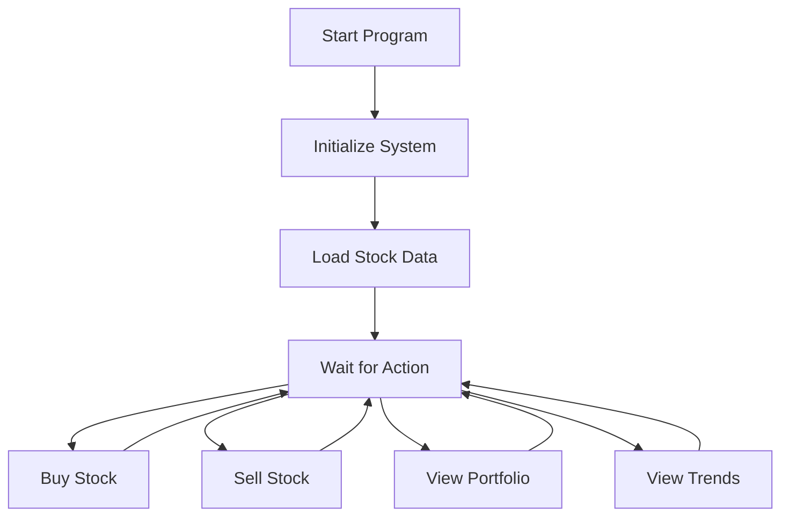

# Understanding Our Stock Trading System
## A Simple Guide for Students

---
## 1. What Does Our Program Do? 

Our program simulates a simple stock trading system where you can:
- Buy and sell stocks
- Track stock prices
- Monitor your portfolio
- View your trading history
- Analyze market trends

---
## 2. Main Components ¸

Think of our program like a bank with three main storage boxes:

```
📦 Stocks Box
- Holds all available stocks
- Keeps track of prices
- Tracks available quantities

👤 Portfolio Box
- Your personal stock holdings
- How many shares you own
- What price you bought them at

📝 Transaction Box
- Record of all trades
- When they happened
- What price they were at
```

---
## 3. How Data is Stored 

### Stock Information
```c
// Each stock has:
- Symbol (like "SCOM" for Safaricom)
- Current Price
- Available Quantity
- Price History (last 30 days)
```

### Portfolio Information
```c
// Each portfolio entry has:
- Stock Symbol
- Quantity Owned
- Average Buy Price
```

### Transaction Information
```c
// Each transaction records:
- Stock Symbol
- Buy or Sell
- Quantity
- Price
- Time of Trade
```

---
## 4. Main Features 

### Buying Stocks
1. Check if stock exists
2. Check if enough stocks are available
3. Calculate total cost
4. Update your portfolio
5. Record the transaction

### Selling Stocks
1. Check if you own enough shares
2. Calculate sale value
3. Update your portfolio
4. Record the transaction

---
## 5. Real-World Example 

Let's follow a simple trading scenario:

```plaintext
1. Initial Purchase:
   Buy 1000 Safaricom (SCOM) shares at 25.50 KES
   - Portfolio: +1000 SCOM
   - Money Spent: 25,500 KES

2. Price Changes:
   SCOM price rises to 27.80 KES
   - Profit on Paper: +2,300 KES

3. Partial Sale:
   Sell 400 SCOM at 27.80 KES
   - Portfolio: Now 600 SCOM
   - Money Received: 11,120 KES
```

---
## 6. How We Display Information 

### Portfolio View
```plaintext
Current Portfolio:
Symbol  Quantity  Buy Price  Current Price  Profit/Loss
SCOM    600       25.50      27.80         +1,380 KES
```

### Market Trends
```plaintext
Market Trends:
Symbol  Current Price  Change   Trend
SCOM    27.80         +2.30    ++++-+
```

---
## 7. Program Flow „



---
## 8. Testing the Program 

Sample Commands:
```c
// Add a stock to the system
addStock("SCOM", 25.50, 10000);

// Buy some shares
buyStock("SCOM", 1000);

// Update stock price
updatePrice("SCOM", 27.80);

// Sell some shares
sellStock("SCOM", 400);
```

---
## 9. Key Learning Points 

1. **Data Organization**
   - How to store related information together
   - How to track changes over time

2. **Program Logic**
   - How to check if actions are possible
   - How to update multiple related pieces of information

3. **Real-World Application**
   - How computer programs handle financial transactions
   - How to track profits and losses

---
## 10. Questions for Discussion ’­

1. Why do we need to store the transaction history?
2. How does the program calculate profits and losses?
3. Why do we track price history for each stock?
4. How could we improve this system?

---
## Thank You! ™

Remember:
- Start with understanding the basic structures
- Follow the flow of data
- Think about how each action affects different parts of the system
